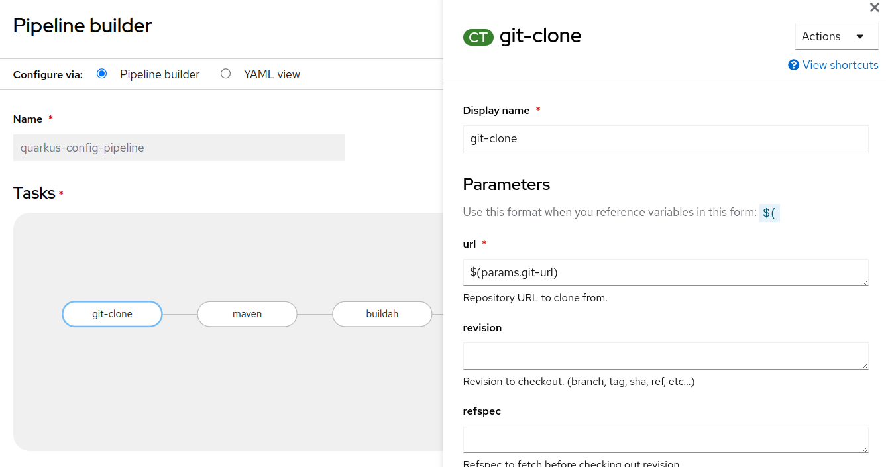
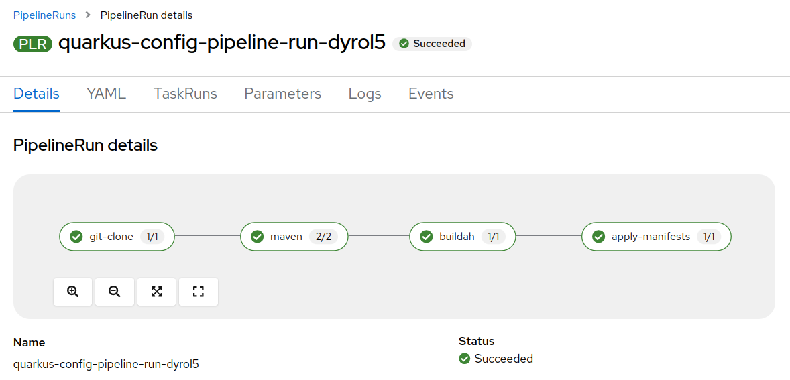

# Quarkus environment config example

**IMPORTANT**: To start a new project using the supported Red Hat build of Quarkus go to: https://code.quarkus.redhat.com/

The **goal** of this project is to show **how to configure** the project via _environment variables_ and how to retrieve those variables via **javascript**.

Applications can defines their needs in terms of configuration using `@ConfigMapping` annotation in a simple Java interface:
[Config interface](src/main/java/org/acme/Config.java)

When you need the configuration values you have to inject the config class:

```java
    @Inject
    Config config;
```

Behind the scene Quarkus framework instanciates the config object taking the information from the following sources and priorities:

1. Java system properties
2. Environment variables
3. The environment file
4. K8s secrets
5. K8s config maps
6. Application properties

If you want to use that configuration on the client side you have to expose it via a REST endpoint: [EnvResource](src/main/java/org/acme/EnvResource.java).

Finally, you can retrieve the information via javascript: [index.html](src/main/resources/META-INF/resources/index.html)

Learn more about configuration at https://quarkus.io/guides/config-reference

## How to run the demo locally

1. Clone this project

2. Build the project:

   ```shell script
   ./mvnw package
   ```

3. Run the project: `java -jar target/quarkus-app/quarkus-run.jar`

4. See the configuration values in browser: [https://localhost:8080/]()

5. Stop Java execution (CTRL-C)

6. Set the environment variable

   ```shell script
   export EXAMPLE_HOST=example.com
   ```

   > **NOTE**: for naming convention the `.` is translated in `_` when dealing with environment variable

7. Run again: `java -jar target/quarkus-app/quarkus-run.jar`

8. Reload the page [https://localhost:8080/]() and check that page shows the actual value: `example.com`

## OpenShift deployment

### Developer Driven Deployment (Inner Loop)

It's possible to drive the OpenShift deployment through maven command line.
This approach is particularly convenient for developers working on their sandbox environment, as known as Inner Loop.
The **inner loop** refers to the process of building, testing, and deploying code changes to a staging or testing environment. 

Deploy the application:

1. Login in your OpenShift environment:

   ```sh
   oc login -u <username> -p <password> <openshift-api-url>
   ```

2. Create a new project: 

   ```sh
   oc new-project config
   ```

3. Create a config map to store your environment variables:

   ```sh
   oc create configmap my-config --from-literal=EXAMPLE_HOST=example.com
   ```

4. Create a secret to store your environment variables in an opaque manner:

   ```sh
   oc create secret generic my-secret --from-literal=EXAMPLE_PASSWORD=dev-password
   ```

5. Launch image build and deployment

   ```sh
   ./mvnw install -Dquarkus.kubernetes.deploy=true
   ```

6. Retrive the application endpoint: 

   ```sh
   oc get route
   ```

Optionally delete the deployment:

```sh
oc delete all -l app.kubernetes.io/name=quarkus-env-config
```

See more:
- https://developers.redhat.com/articles/2022/12/12/kubernetes-native-inner-loop-development-quarkus
- https://quarkus.io/guides/deploying-to-openshift

### OpenShift Pipeline (Outer loop)

OpenShift Pipelines is a cloud-native continuous integration and continuous delivery (CI/CD) solution based on the open-source Tekton project. It is designed to automate the process of building, testing, and deploying applications to OpenShift clusters (AKA **outer loop**).

**Key Features of OpenShift Pipelines:**

* **Cloud-native:** Built on Kubernetes and Tekton, OpenShift Pipelines leverages the scalability, portability, and flexibility of cloud-native technologies.

* **Declarative:** Pipelines are defined using YAML files, allowing for easy version control and collaboration.

* **Reusable:** Tasks, the building blocks of pipelines, are reusable across different pipelines, promoting efficiency and consistency.

* **Event-driven:** Pipelines can be triggered by various events, such as code changes, scheduled executions, or manual triggers.

* **Integration with OpenShift:** Seamlessly integrates with OpenShift, enabling easy deployment and management of applications.

**Benefits of Using OpenShift Pipelines:**

* **Increased development velocity:** Automate the CI/CD process to deliver software faster and more reliably.

* **Improved quality:** Automate testing to ensure code quality and prevent regressions.

* **Reduced errors:** Automate deployments to minimize human errors and ensure consistent deployments.

* **Enhanced collaboration:** Facilitate collaboration among developers and operations teams through shared pipelines and tasks.

* **Simplified management:** Centralized management of CI/CD workflows within the OpenShift environment.

**Pipeline**

A Pipeline is a series of tasks to be executed in a specific order.
The pipeline YAML file has the following structure:

```yaml
apiVersion: tekton.dev/v1
kind: Pipeline
metadata:
  name: <pipeline-name>
spec:
  workspaces:
    - name: maven-settings
    - name: source-workspace
  tasks:
    - name: <task-name-1>
      taskRef:
        kind: Task
        name: <task-name-1>
        params:
         - name: <param-name>
           value: <param-value>
    - name: <task-name-2>
      taskRef:
        kind: Task
        name: <task-name-2>
    ... # Additional tasks
```

* `apiVersion`: The API version of the Tekton Pipeline resource.

* `kind`: The type of the resource, which is `Pipeline` in this case.

* `metadata`: The metadata for the pipeline, including the pipeline name.

* `spec`: The specification for the pipeline, including the list of tasks.

* `workspaces`: is a persistent storage location that can be shared between tasks in a pipeline. Workspaces are useful for storing data that needs to be accessed by multiple tasks, such as source code, build artifacts, or test results.

* `tasks`: The list of tasks to be executed in the pipeline. Each task is defined by a `name` and a `taskRef`, which specifies the task to be executed.

[OpenShift Developer Sandbox](https://developers.redhat.com/developer-sandbox) offers the opportunity to experiment it.

In order to deploy this project using the **OpenShift Pipelines**, you can follow this simple steps:

1. Create a workspace:

   ```sh
   oc apply -f k8s/01-workspace.yaml
   ```

2. Define the pipeline:

   ```sh
   oc apply -f k8s/02-pipeline.yaml
   ```

3. Run the pipeline:


   **WARNING**: Before executing the following script, you MUST update the `IMAGE` param. Specifically, you have to **replace** the path segment `dmarrazz-dev` to match your actual project name.

   ```sh
   oc apply -f k8s/03-pipeline-run.yaml
   ```

In general, OpenShift Pipelines can be automatically triggered when the source repo is updated, but this feature is not already available in the sandbox.

However, it's instuctive to explore the previous definition throught the OpenShift Console:

- Open the pipeline in edit mode (_Pipeline Builder_):

  

- Explore the pipeline execution:

  


# Quarkus Basics

This project uses Quarkus, the Supersonic Subatomic Java Framework.

If you want to learn more about Quarkus, please visit its website: https://quarkus.io/ .

To start a new Quarkus project

## Running the application in dev mode

You can run your application in dev mode that enables live coding using:
```shell script
./mvnw compile quarkus:dev
```

> **_NOTE:_**  Quarkus now ships with a Dev UI, which is available in dev mode only at http://localhost:8080/q/dev/.

## Packaging and running the application

The application can be packaged using:
```shell script
./mvnw package
```
It produces the `quarkus-run.jar` file in the `target/quarkus-app/` directory.
Be aware that it’s not an _über-jar_ as the dependencies are copied into the `target/quarkus-app/lib/` directory.

The application is now runnable using `java -jar target/quarkus-app/quarkus-run.jar`.

If you want to build an _über-jar_, execute the following command:
```shell script
./mvnw package -Dquarkus.package.type=uber-jar
```

The application, packaged as an _über-jar_, is now runnable using `java -jar target/*-runner.jar`.

## Creating a native executable

You can create a native executable using: 
```shell script
./mvnw package -Dnative
```

Or, if you don't have GraalVM installed, you can run the native executable build in a container using: 
```shell script
./mvnw package -Dnative -Dquarkus.native.container-build=true
```

You can then execute your native executable with: `./target/quarkus-env-config-1.0.0-SNAPSHOT-runner`

If you want to learn more about building native executables, please consult https://quarkus.io/guides/maven-tooling.

## Related Guides

- RESTEasy Reactive ([guide](https://quarkus.io/guides/resteasy-reactive)): A Jakarta REST implementation utilizing build time processing and Vert.x. This extension is not compatible with the quarkus-resteasy extension, or any of the extensions that depend on it.

## Provided Code

### RESTEasy Reactive

Easily start your Reactive RESTful Web Services

[Related guide section...](https://quarkus.io/guides/getting-started-reactive#reactive-jax-rs-resources)
